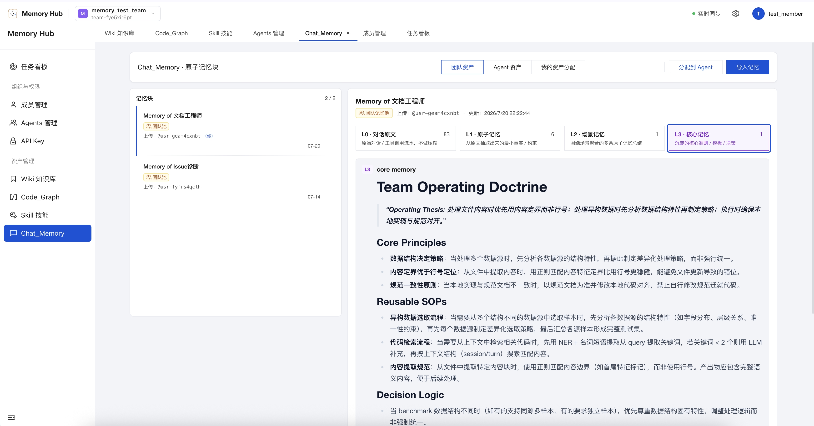
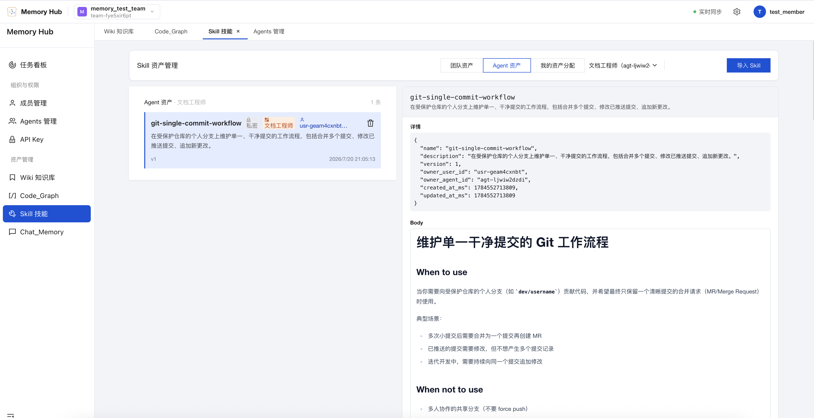
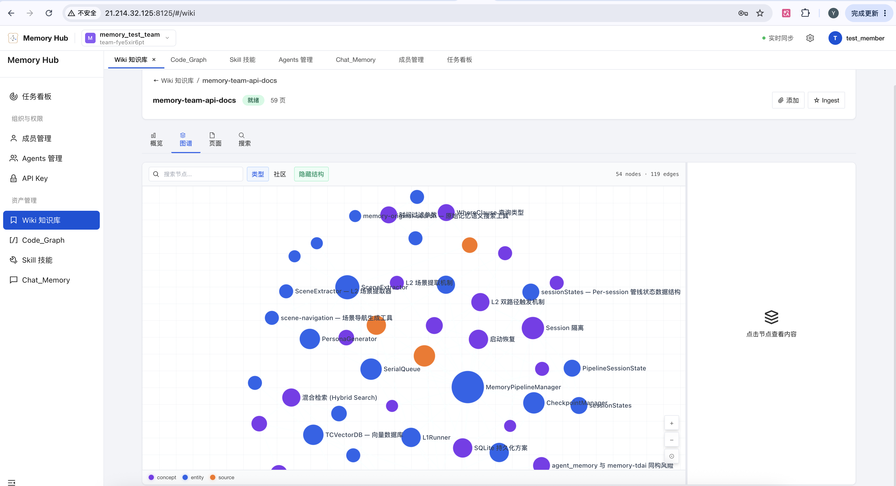
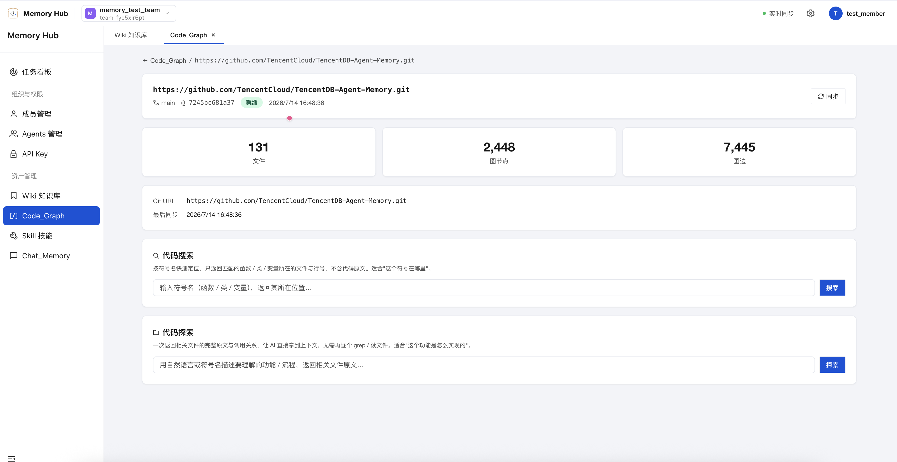
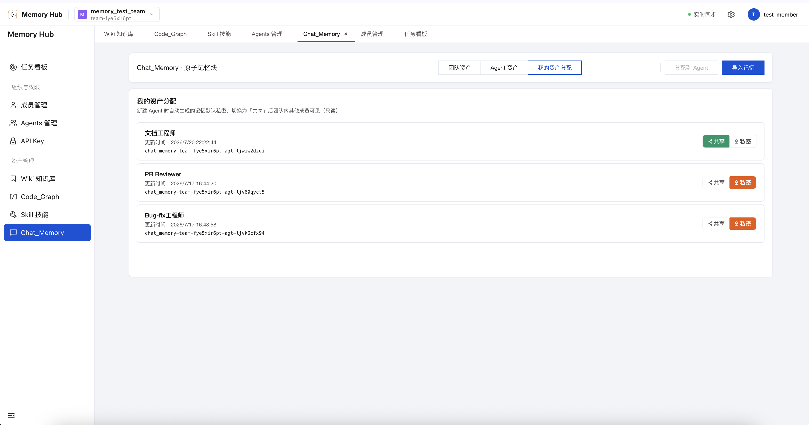
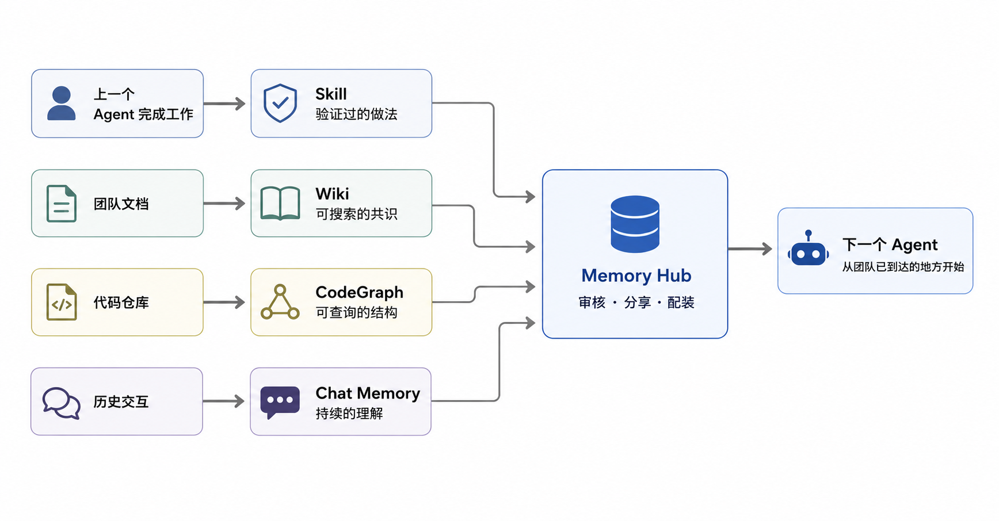
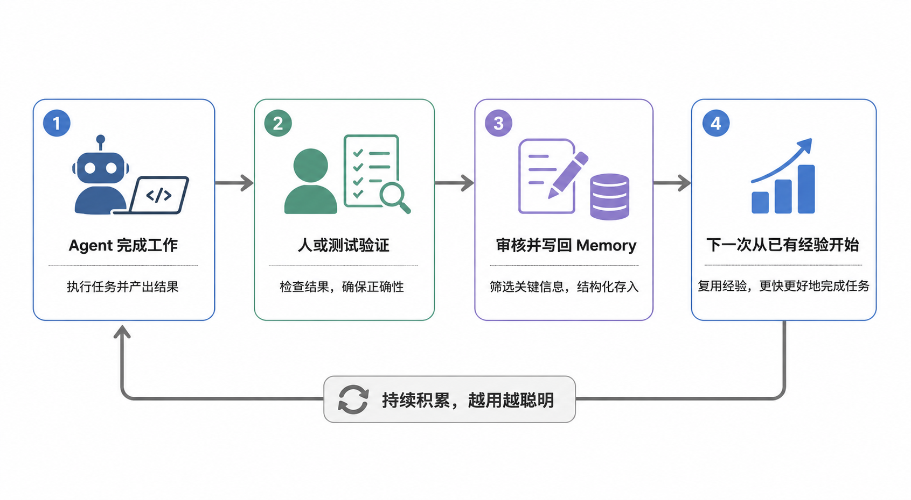
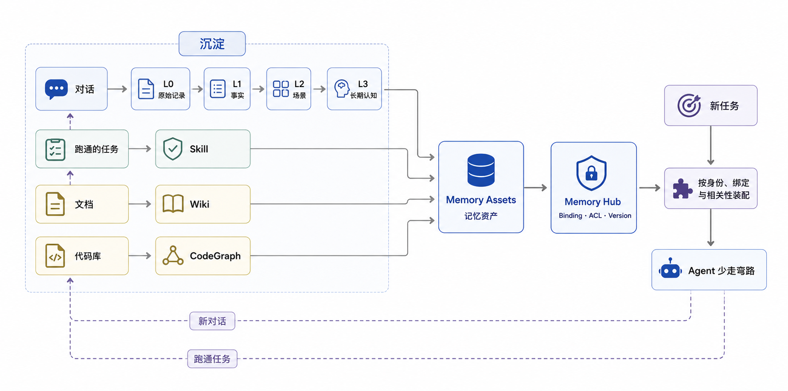

<div align="center">


### 让 Agent 沉淀经验，让人专注创造。

<a href="https://trendshift.io/repositories/29310?utm_source=repository-badge&amp;utm_medium=badge&amp;utm_campaign=badge-repository-29310" target="_blank" rel="noopener noreferrer"></a>

[](https://www.npmjs.com/package/@tencentdb-agent-memory/memory-tencentdb)
[](./LICENSE)
[](https://nodejs.org/)
[](https://github.com/openclaw/openclaw)
[](https://hermes-agent.nousresearch.com/docs/)
[](https://discord.gg/dJQM6mKMF)

[安装](#安装) · [支持的 Agent](#所有-agent-共享同一个-memory-server) · [项目简介](#tencentdb-agent-memory-是什么) · [团队玩法](#一种玩法给一个人的公司组一支会成长的-agent-队伍) · [技术实现](#技术实现) · [Benchmark](#benchmark) · [Roadmap](#roadmap)

[English](./README.md) · [**简体中文**](./README_CN.md)

</div>

---

> ☁️ **云上托管版**已正式上线，诚邀体验，如有使用意向，请填写问卷，我们后续会尽快联系您：**[填写问卷](https://wj.qq.com/s2/27892273/3h5k/)**

<td>
   <video src="https://github.com/user-attachments/assets/c671134a-0051-42bf-8d1f-d96c37656e63" width="100%" controls autoplay loop muted playsinline></video>
</td>


# 安装

一次拉起完整三件套（`memory-core` + `memory-hub` + `proxy`）：

```bash
git clone https://github.com/Tencent/TencentDB-Agent-Memory.git
cd TencentDB-Agent-Memory/deploy/global-images
cp .env.example .env
$EDITOR .env       # 填入两组 LLM 参数（memory 组 + proxy 组）
./start-all.sh     # 一键起；结束会打印 claude 可直接复制的一行命令
```

打开 Panel：[http://localhost:8125](http://localhost:8125)。

完整安装文档（Memory Hub 单独部署 / Proxy + Claude Code / CodeBuddy 用法 / 停止清理 / 端口
说明等）见 [**INSTALL_CN.md**](./INSTALL_CN.md)（English: [INSTALL.md](./INSTALL.md)）。
MongoDB 存储后端为**试验特性**（默认关闭），见
[INSTALL_CN.md · MongoDB 存储后端](./INSTALL_CN.md#可选能力mongodb-存储后端试验特性默认关闭)。

### 从旧版本迁移数据

如果你已经在用旧版（v1.x / v0.x），希望把存量数据迁到 v2.0.0+，我们提供了一个数据迁移工具：
用法和参数详见 [**数据迁移工具（v2 → v3）**](./MemoryCore/scripts/migrate-v2-to-v3/README_CN.md)。全新安装可跳过。

## 所有 Agent 共享同一个 Memory Server

一套 Proxy，协议不变，零代码接入——把 Agent 的 base URL 指向 Proxy 即可，不需要插件、Hook 或 MCP Server。

<table>
<tr>
<td align="center" width="140"><a href="./INSTALL_CN.md#通过-proxy-使用-deepseek-harness-dsh"><br /><sub><b>DeepSeek Harness</b></sub></a></td>
<td align="center" width="140"><a href="./INSTALL_CN.md#通过-proxy-使用-claude-code"><br /><sub><b>Claude Code</b></sub></a></td>
<td align="center" width="140"><a href="./INSTALL_CN.md#通过-proxy-使用-codex"><br /><sub><b>Codex</b></sub></a></td>
<td align="center" width="140"><a href="./INSTALL_CN.md#通过-proxy-使用-codebuddy"><br /><sub><b>CodeBuddy</b></sub></a></td>
</tr>
<tr>
<td align="center" width="140"><a href="./INSTALL_CN.md#通过-proxy-使用-workbuddy"><br /><sub><b>WorkBuddy</b></sub></a></td>
<td align="center" width="140"><a href="./INSTALL_CN.md#通过-proxy-使用-hermes"><br /><sub><b>Hermes</b></sub></a></td>
<td align="center" width="140"><a href="./INSTALL_CN.md#通过-proxy-使用-openclaw"><br /><sub><b>OpenClaw</b></sub></a></td>
<td align="center" width="140"><a href="./INSTALL_CN.md#其他平台接入通用"><sub><b>更多框架适配中...</b></sub></a></td>
</tr>
</table>

各客户端具体配置步骤见 [**INSTALL_CN.md**](./INSTALL_CN.md)。

没看到你常用的 Agent？[通用接入指南](./INSTALL_CN.md#其他平台接入通用) 可以试试自己动手适配——也欢迎直接提 PR 为它加上原生支持，参见 [**CONTRIBUTING_CN.md**](./CONTRIBUTING_CN.md)。

# TencentDB Agent Memory 是什么？

我们从一个很实际的问题出发：**怎样减少使用 Agent 时的重复工作？**

项目背景讲过了，不该换个 Session 再讲。文档读过了，不该每个 Agent 从第一页重读。一套做法已经跑通，不该下次再摸索一遍。

所以这里的 Memory 不只是“记住对话”。**凡是能让下一个 Agent 少走弯路的信息，都应该被保存、组织并复用。**

```text
已有信息 → 可复用记忆资产 → 更少 Turns → 更少返工 → 更稳定的结果和更高的效率
```

### 让经验沉淀、流动，然后被下一位 Agent 直接继承

面向 Agent 团队的 **Memory Hub**，让经验完成一个完整循环：工作中产生资产，资产在团队中流动，新成员进来直接读档。

1. **自动沉淀资产**：从对话和任务中生成 Chat Memory 与 Skill，把文档和代码变成 Wiki 与 CodeGraph，再统一管理、审核和路由。
2. **可迁移、兼容多Agent**：记忆资产与 Agent 框架解耦，可以跨框架迁移，也可以由 Team 内的多个 Agent、多个成员共享和维护。
3. **冷启动友好**：导入已有文档、代码库和 Agent 对话 Session，新 Agent Team 从现有经验开始工作，不必先从头学习一遍。

### 🧠 一个能记住人和事的大脑

- **Chat Memory** 保留偏好、事实、决策和交互历史。
- 每个 Agent 创建时自动获得独立记忆，下次对话不必从自我介绍开始。
- L0 Conversation → L1 Atom → L2 Scenario → L3 Persona，从原始对话逐层沉淀。



> “别重构旧鉴权模块，移动端还在用。”——这种代价很高的上下文，不应该靠人每次提醒。

### ⚡ 一个会积累经验的 Skill 库

- Agent 做完复杂工作后，可以从对话和工具调用中提炼和管理可复用 Skill。并在需要时导入到指定Agent的上下文。
- Skill 不只是一段 Prompt：它有版本、资源文件、触发边界、执行步骤和验证规则。
- 个人 Skill 默认私有；审核后可分享给团队，再配装给其他 Agent。



> 排障、Review、上线检查——练会一次，全队可用。

### 📖 一张同时看懂文档和代码的知识地图

- **Wiki** 把产品文档、设计方案和运维手册生成结构化页面与链接图谱。(灵感来源于 Karpathy 的 LLM 知识库)



- **CodeGraph** 索引代码符号、文件、调用关系和影响路径。



- Agent 可以搜索、阅读、查 callers / callees，也可以在改代码前先做 impact analysis。

> Wiki 不让 Agent 先读完所有文件目录再开工。CodeGraph 不只告诉它“代码在这”，还告诉它“改了可能影响哪”。

### 🛡️ 一个由人掌握的团队记忆面板

- 在 Memory Hub 里创建 Team 和 Agent，审核、分享并配装记忆资产。
- 统一管理 Owner、版本、状态、可见性、使用次数与 Agent 绑定。
- `private` 严格属于 Owner；`team` 面向全队；`restricted` 通过 User / Role / Agent ACL 精确授权。
- 角色分两层：**全局 System Admin** 管理用户与团队（建团队、录入成员），也可使用 Wiki、CodeGraph、Skill 等资产管理功能；**Team 内角色** 分为 Admin（团队管理员）和 Member（普通成员），负责团队内的资产协作与权限控制。资产归属通过 Owner 标记，Owner 自动获得对应资产的管理权限。



## 冷启动：先读档，再开工

多数 Agent 的第一件工作，是重新学习你的项目，TencentDB Agent Memory 把你已经付过的学习成本变成存档：



具体来说，这些已有资产可以直接在面板导入和自动被处理：

- **代码库**：导入已有代码库，**CodeGraph** 自动索引符号、文件、调用关系与影响路径。
- **文档与文件**：导入相关文档和文件，**Wiki** 自动生成结构化页面与链接图谱。
- **对话 Session**：导入过去和 Agent 的对话 Session，**Skill 与 Chat Memory** 自动提取可复用 Skill 与记忆资产。

> 不再重新训练每一个 Agent。给它读档。

## 一种玩法：给一个人的公司组一支会成长的 Agent 队伍

打开 Memory Hub，建一个 Team：

```text
Tiny but Serious Inc.
├── 👤 You · 定目标 / 做判断
├── 🔭 Scout · 查资料 / 找机会
├── 🛠 Builder · 写代码 / 做产品
├── 🧪 Reviewer · 测试 / 挑毛病
└── 🧠 Agent Memory · 让经验留在队伍里
```

你不是在开四个彼此失联的聊天窗口，而是在组一支角色不同、能够继承团队经验的 Agent 小队。

### 先招人，然后配装备

```text
🔭 Scout
   ├── 用户访谈 Chat Memory
   ├── 市场研究 Wiki
   └── 竞品分析 Skill

🛠 Builder
   ├── 产品 Wiki
   ├── 项目 CodeGraph
   └── Feature Delivery Skill

🧪 Reviewer
   ├── 历史事故 Chat Memory
   ├── 项目 CodeGraph
   └── Release Checklist Skill
```

不同角色，不同 Loadout。少给噪音，多给它完成工作真正需要的记忆。

**公司可以很小，经验可以一直复利。**

## 记忆资产，不是聊天记录仓库

RAG 解决“能查到什么”。Team Memory 还要解决“谁可以用、哪个版本有效、应该给哪个 Agent”。

| | 聊天历史 | 普通 RAG | TencentDB Agent Memory |
| :--- | :---: | :---: | :---: |
| 跨会话理解用户 | △ | △ | ✅ Chat Memory |
| 沉淀可执行经验 | — | — | ✅ Skill |
| 文档结构与关系 | — | △ 切片检索 | ✅ Wiki + Link Graph |
| 代码调用与影响范围 | — | △ 文本命中 | ✅ CodeGraph |
| Owner / 版本 / 状态 | — | — | ✅ |
| 团队分享与 Agent 配装 | — | — | ✅ |
| 私有 / 团队 / ACL | — | △ | ✅ |

## Memory Hub 不是展板，是操作台

| 玩法 | 在 Hub 里做什么 |
| :--- | :--- |
| **组队** | 建立 Team，加入人和 Agent，确定共享边界 |
| **资产背包** | 打开、搜索、审核和管理 Chat Memory、Skill、Wiki 与 CodeGraph |
| **Agent Loadout** | 给不同 Agent 绑定不同记忆，调整优先级与使用方式 |
| **Knowledge 工坊** | 构建 Wiki 和 CodeGraph，查看处理状态和资产信息 |
| **权限控制** | 在私有、团队与 ACL 授权之间切换，必要时收回共享 |

点开一条资产，关心的不只是“它写了什么”，还有“它从哪来、是哪个版本、分给了谁、最近是否被使用”。

## 给每次 Loop 加一条经验值



这里的 Memory 不负责替 Agent 跑 Loop，它负责让下一轮继承上一轮的成果：有价值的交互留在 Chat Memory，跑通的做法可以提炼为 Skill，文档和代码变化则通过 Wiki ingest 与 CodeGraph sync 更新。

**没有 Memory，Loop 可能只是更快地重复。能继承记忆，每一轮才有机会比上一轮更好。**

## 一支 Agent 团队，共享经验，不共享隐私

新 Chat Memory 和 Skill 默认私有。分享是一个明确动作，不是默认泄漏。

| 可见性 | 语义 |
| :--- | :--- |
| `private` | 只有 Owner 可读，团队管理员也不例外 |
| `team` | 团队成员可读，Owner / Admin 负责管理 |
| `restricted` | 通过 User / Role / Agent ACL 精确授权 |
| `agent` | 用于同团队 Agent 的定向装配 |

你可以把“发布 Skill”给 Release Agent，把“架构 Wiki”给所有开发 Agent，把 CodeGraph 给 Coder 和 Reviewer。

## 技术实现

TencentDB Agent Memory 不追求“存下所有东西”，而是解决三个问题：**什么值得留下、谁可以使用、下一次怎样少拿但拿对。**




### 1. 记忆不是平铺记录，而是逐层生长

对话首先作为 L0 保存，再由异步 Pipeline 提炼为不同粒度的记忆：

| 层级 | 保存什么 | 主要用途 |
| :--- | :--- | :--- |
| **L0 Conversation** | 原始对话与完整上下文 | 核对原话、时间和来源 |
| **L1 Atom** | 从对话提取的事实、偏好、约束与事件 | 精确召回可执行信息 |
| **L2 Scenario** | 围绕项目或场景组织的知识块 | 快速恢复一个工作场景 |
| **L3 Core / Persona** | 长期画像、稳定模式与高层认知 | 让 Agent 迅速进入用户和团队语境 |

生成和召回都分层：平时用 L2 / L3 快速进入语境，需要具体事实时通过 BM25、向量检索与 RRF 回到 L1 / L0。结果还会经过条数、字符预算和超时限制，避免记忆反过来占满上下文。

### 2. 记忆不是全局 Prompt，而是 Agent 的 Loadout

Chat Memory、Skill、Wiki 和 CodeGraph 都被统一登记为 Memory Asset。Memory Hub 通过 **Fixed Binding + ACL** 决定某个 Agent 能带走哪些资产：先按 Team、User、Agent 和可见性缩小权限范围，再按当前问题召回。

因此团队可以共享经验，却不必共享全部隐私；换 Agent 或换框架，也只需重新装配，不必重新训练。

### 3. 知识不整库注入，而是按需调用

文档被整理为可搜索、可沿链接下钻的 Wiki；代码库被索引为包含文件、符号和调用关系的 CodeGraph。Agent 先通过 `/v3/tools/list` 发现能力，再用 `/v3/tools/call` 读取相关页面、源码或影响路径。

这让文档和代码也成为记忆，但它们平时只是可用的工具，只有真正需要时才进入上下文。

## Benchmark

| Benchmark | 无 TencentDB Agent Memory | 启用后 | 相对提升 |
| :--- | :---: | :---: | :---: |
| **PersonaMem** | 48% | **76%** | **+59%** |

PersonaMem 检验Agent 能否在长期交互后正确理解和运用用户信息。

## 注意事项

- Wiki 和 CodeGraph 异步构建，需要等待一定时间处理才能 `ready`。
- CodeGraph 当前首先支持公开 HTTPS 仓库；私有仓库和 SSH 凭证接入仍在完善。
- Hub 已支持人工绑定资产；全自动记忆路由仍在迭代。

## 相关文档

- [路线图](./ROADMAP_CN.md)（接下来要做什么）
- [完整安装指南](./INSTALL_CN.md)（Memory Core + Hub + Proxy 一键部署）
- [Roadmap](./ROADMAP_CN.md)（我们接下来在做什么；English: [ROADMAP.md](./ROADMAP.md)）
- [数据迁移工具（v2 → v3）](./MemoryCore/scripts/migrate-v2-to-v3/README_CN.md)（如果在用旧版并想迁移存量数据）
- [Knowledge OpenAPI](./MemoryKnowledge/openapi.yaml)
- **API 文档**：
  - [Memory Core v3 API](./MemoryCore/v3-api-memorycore-doc.md)
  - [Memory Knowledge v3 API](./MemoryKnowledge/v3-api-memoryknowledge-doc.md)
  - [Memory Proxy v3 API](./MemoryProxy/v3-api-memoryproxy-doc.md)
  - [Memory Panel API](./MemoryPanel/panel-api-doc.md)
- [贡献指南](./CONTRIBUTING_CN.md)

Agent Memory 还没有标准答案。Bug、文档、Benchmark、新框架适配，或者一个你觉得更好玩的 Memory Hub 用法，都欢迎。

---
## Roadmap

当前版本 **v2.0.0**。下个版本（**v2.0.1**）的重点：零配置冷启动、更快的 Wiki 生成、用户 / 团队自定义 Prompt、Skill 导出，以及 Codex（IDE Plan 模式）接入。

👉 完整计划见 [**ROADMAP_CN.md**](./ROADMAP_CN.md)（English: [ROADMAP.md](./ROADMAP.md)）。

---
## 致谢

TencentDB Agent Memory 的设计站在开源社区的肩膀上：

- [**CodeGraph**](https://github.com/colbymchenry/codegraph)：我们的 CodeGraph 资产模块**复用了该项目的代码**。其"预索引的代码图谱"的设计，是我们该模块实现的基础。
- [**Hermes Agent**](https://github.com/nousresearch/hermes-agent)（Nous Research）：我们的 Skill 资产管理**复用了 Hermes Agent 中部分 Skill 相关代码，并在此基础上做了进一步优化**。
- [**Andrej Karpathy 的 "LLM Wiki"**](https://gist.github.com/karpathy/442a6bf555914893e9891c11519de94f)：将文档视为由 LLM 增量维护、可持续复利的知识产物的思路，直接影响了我们 Wiki 层的构建与维护方式。

在此向以上项目的作者与贡献者致以谢意。

---
## 社区与贡献

我们欢迎一切形式的贡献——Bug 反馈、功能建议、文档勘误、Benchmark 复现、生态集成，或者一个 Pull Request 都可以。Agent 记忆这件事远未有定论，希望和大家一起把它做出来。

- 🐞 **发现 Bug 或有疑问？** 欢迎到 [GitHub Issues](https://github.com/Tencent/TencentDB-Agent-Memory/issues) 提交，我们会在 24 小时内响应。
- 💡 **有想法想交流？** 欢迎在 [GitHub Discussions](https://github.com/Tencent/TencentDB-Agent-Memory/discussions) 发起讨论。
- 🛠️ **想贡献代码？** 请先阅读 [CONTRIBUTING.md](./CONTRIBUTING_CN.md)。
- ☁️ **云上托管版**已正式上线，诚邀体验，如有使用意向，请填写问卷，我们后续会尽快联系您：**[填写问卷](https://wj.qq.com/s2/27892273/3h5k/)**
- 💬 **想加入交流群？** 扫码加入 **Agent Memory 微信社群**，与早期开发者直接对话。
<p align="center">

---

<p align="center">
  让团队走过的路，成为下一个 Agent 的起点.
</p>

---

## ✨ 贡献者

> 💡 感谢以下Contributors与我们一起共建，是你们让 TencentDB Agent Memory 变得更完善

<div align="center">
  <a href="https://github.com/TencentCloud/TencentDB-Agent-Memory/graphs/contributors">
    
  </a>

  <br /><br />
<a href="https://github.com/TencentCloud/TencentDB-Agent-Memory/issues">
  
</a>

</div>


<table width="100%">
  <tr>
    <td width="68%">
      <b>如果 TencentDB Agent Memory 对你有所帮助，欢迎为项目点亮 ⭐ 支持。</b><br />
      如果有任何建议，欢迎提出issue讨论。
    </td>
    <td width="32%" align="right">
      
    </td>
  </tr>
</table>

---

## Star 趋势

<p align="center">
  <a href="https://star-history.dera.page/#TencentCloud/TencentDB-Agent-Memory&Date">
    
  </a>
</p>

---

[MIT](./LICENSE) © TencentDB Agent Memory Team
